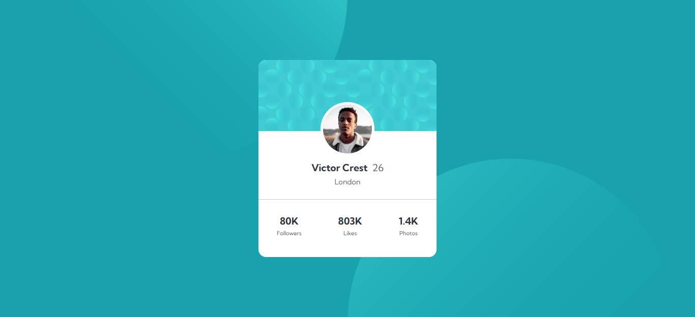

# Frontend Mentor - Profile card component

This is a solution to the [Profile card component on Frontend Mentor](https://www.frontendmentor.io/challenges/profile-card-component-cfArpWshJ).  
Frontend Mentor challenges help you improve your coding skills by building realistic projects.

---

## 📸 Screenshot

---

## 🔗 Links

- **Solution URL:** [https://www.frontendmentor.io/challenges/profile-card-component-cfArpWshJ?tab=report](#)
- **Live Site URL:** [https://fransantos103.github.io/frontendMentorEasy-Profile-card-component/](#)

---

## 💻 My process

### Built with
- Semantic **HTML5** markup  
- **CSS3** (Flexbox, custom fonts)  
- Responsive design principles  

---

## 🧠 What I learned

While working on this project, I reinforced my understanding of:
- Using **semantic HTML** (`<main>`)
- Creating **centered layouts** with Flexbox  
- Designing **consistent color palettes**

Here’s a little code snippet I’m proud of:

.cardHeader{
    position: relative;

}
.cardBg{
    width: 100%;
    height: auto;
    max-height: 150px;
    object-fit: cover;
    border-top-left-radius:15px ;
    border-top-right-radius:15px ;
    position: relative;
}

.profileImg{
    position: absolute;
    left: 50%;
    right: 50%;
    transform: translate(-50%, -50%);
    top: 95%;
    border-radius: 50%;
    border: 5px solid white;
}
